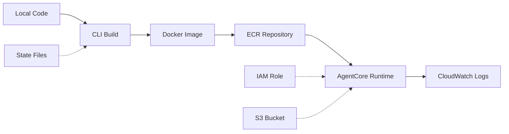

## What is the Nova Act CLI?

The Nova Act CLI is a command-line tool that provides a streamlined process for deploying Python workflows to AWS AgentCore Runtime. It handles containerization, ECR management, IAM roles, S3 bucket creation, and AgentCore Runtime deployments automatically with account-based configuration management.

<Warning>
The Nova Act CLI is a convenience utility to quickstart the creation and deployment of remote Nova Act workflows. It **SHOULD NOT** be used as a dependency in production code!
</Warning>

## Key Features

<CardGroup cols={2}>
  <Card title="Quick Deploy" icon="rocket">
    Deploy any Python script directly without pre-configuration
  </Card>
  <Card title="Auto-Containerization" icon="docker">
    Automatic Docker image building and management
  </Card>
  <Card title="ECR Management" icon="aws">
    Automatic repository creation and image pushing
  </Card>
  <Card title="IAM Integration" icon="shield">
    Automatic role creation and permission management
  </Card>
  <Card title="Multi-Region Support" icon="globe">
    Deploy to any AWS region with isolated state management
  </Card>
  <Card title="Workflow Tracking" icon="list">
    Persistent configuration with file locking for concurrent access
  </Card>
</CardGroup>

## How It Works

The CLI provides two primary deployment workflows:

### Named Workflow Management (Recommended)

Create and manage named workflows for repeated deployments and console visibility:

```bash
# 1. Create workflow configuration
act workflow create --name my-workflow

# 2. Deploy the workflow
act workflow deploy --name my-workflow --source-dir /path/to/project

# 3. Run the deployed workflow
act workflow run --name my-workflow --payload '{"input": "data"}'
```

### Quick Deploy

Deploy any Python script directly without pre-creating a named workflow:

```bash
# Deploy a directory with auto-detected entry point
act workflow deploy --source-dir /path/to/your/project

# Deploy with specific entry point
act workflow deploy --source-dir /path/to/project --entry-point my_script.py

# Run the deployed workflow (uses auto-generated name)
act workflow run --name workflow-20251130-120945 --payload '{"input": "test data"}'
```

<Note>
Quick deploy creates a persistent workflow with an auto-generated name like `workflow-20251130-120945`. The workflow remains in your configuration and can be managed with standard workflow commands (`list`, `show`, `delete`, etc.).
</Note>

## When to Use the CLI

<AccordionGroup>
  <Accordion title="Development & Testing">
    The CLI is ideal for:
    - Rapid prototyping of Nova Act workflows
    - Testing workflows in AWS AgentCore environment
    - Debugging workflow behavior in production-like conditions
    - Iterating on workflow logic with quick redeployment
  </Accordion>

  <Accordion title="Demo & POC">
    Perfect for:
    - Demonstrating Nova Act capabilities
    - Building proof-of-concept applications
    - Exploring AWS AgentCore features
    - Quick experimentation with browser automation
  </Accordion>

  <Accordion title="Personal Projects">
    Great for:
    - Small-scale automation tasks
    - Personal productivity workflows
    - Learning Nova Act and AWS services
    - Side projects and hackathons
  </Accordion>
</AccordionGroup>

## When NOT to Use the CLI

<Warning>
**Production deployments** should use infrastructure-as-code tools like:
- AWS CDK
- Terraform
- CloudFormation
- AWS SAM

These tools provide:
- Version control integration
- Automated testing and validation
- Rollback capabilities
- Team collaboration features
- CI/CD pipeline integration
</Warning>

## AWS Resources Created

The CLI automatically provisions and manages these AWS resources:

| Resource | Naming Pattern | Description |
|----------|---------------|-------------|
| **ECR Repository** | `nova-act-cli-default` | Shared across workflows |
| **IAM Role** | `nova-act-{workflow-name}-role` | Auto-created unless `--execution-role-arn` provided |
| **S3 Bucket** | `nova-act-{account-id}-{region}` | Auto-created unless `--skip-s3-creation` |
| **AgentCore Runtime** | Custom | One per workflow |
| **WorkflowDefinition** | Custom | Auto-created via nova-act service |
| **CloudWatch Logs** | `/aws/bedrock-agentcore/runtimes/{agent-id}*` | Runtime and OTEL logs |

## Architecture



## State Management

The CLI maintains separate state files per AWS account and region:

```
~/.act_cli/
├── state/
│   ├── 123456789012/
│   │   ├── us-east-1/
│   │   │   └── workflows.json
│   │   └── us-west-2/
│   │       └── workflows.json
│   └── 987654321098/
│       └── us-east-1/
│           └── workflows.json
├── builds/
│   └── {workflow-name}/
└── config.yml
```

## Next Steps

<CardGroup cols={2}>
  <Card title="Installation" icon="download" href="/cli/installation">
    Install the CLI and configure prerequisites
  </Card>
  <Card title="Commands Reference" icon="terminal" href="/cli/commands">
    Learn all available CLI commands
  </Card>
  <Card title="Deployment Guide" icon="rocket" href="/cli/deployment">
    Deploy your first workflow
  </Card>
  <Card title="Configuration" icon="gear" href="/cli/configuration">
    Configure profiles, regions, and environment variables
  </Card>
</CardGroup>
